# UniID — Smart Campus Identity & Access System

<p align="center">
  
  
  
  
</p>

**UniID** is a unified campus identity platform that enables **attendance, access control, and payments** using a single RFID-based ID card. Built for the Online Hackathon, this project demonstrates how campuses can unify fragmented identity systems into one intelligent, scalable solution.

---

## 🌟 Key Principle

> **The card is identity. All intelligence lives on the server.**

The RFID card stores only a unique identifier (UID). All business logic — permissions, wallet management, attendance tracking, and service policies — is handled by the centralized backend. This architecture ensures:

- **Security**: No sensitive data on the card
- **Flexibility**: Policies can change without reissuing cards
- **Scalability**: Single source of truth for all campus services

---

## 🎯 Problem Statement

Modern campuses suffer from **fragmented identity systems**:

| Problem | Impact |
|---------|--------|
| Multiple Cards | Students carry separate cards for library, mess, transport |
| Siloed Databases | Each department maintains isolated systems |
| Manual Attendance | Time-consuming paper-based or biometric processes |
| Weak Access Control | Inconsistent security across facilities |

---

## ✨ Solution: UniID

UniID solves these problems by providing:

- **Single Identity Card**: One RFID card for all campus services
- **Unified Backend**: Centralized database and policy engine
- **Smart Services**: Attendance, library, mess, transport — all via one tap
- **Real-time Dashboard**: Admin visibility into all campus activities

---

## 🏗️ System Architecture

```mermaid
flowchart TB
    subgraph "Frontend Layer"
        HP[🏠 Home Page]
        SIM[🔄 RFID Simulator]
        ADMIN[📊 Admin Dashboard]
    end

    subgraph "API Layer"
        TAP["/api/tap"]
        STU["/api/students"]
        ATT["/api/attendance"]
        TXN["/api/transactions"]
        POL["/api/policies"]
        RST["/api/reset-demo"]
    end

    subgraph "Business Logic"
        AUTH[🔐 Identity Verification]
        POLICY[📋 Policy Engine]
        WALLET[💳 Wallet Service]
        ATTEND[📅 Attendance Service]
    end

    subgraph "Data Layer"
        DB[(PostgreSQL Database)]
        ST[students]
        TX[transactions]
        AT[attendance]
        PL[policies]
    end

    HP --> SIM
    HP --> ADMIN
    SIM --> TAP
    ADMIN --> STU
    ADMIN --> ATT
    ADMIN --> TXN
    ADMIN --> POL
    
    TAP --> AUTH
    AUTH --> POLICY
    POLICY --> WALLET
    POLICY --> ATTEND
    
    WALLET --> DB
    ATTEND --> DB
    DB --> ST
    DB --> TX
    DB --> AT
    DB --> PL
```



---

## 🔄 RFID Tap Flow

```mermaid
sequenceDiagram
    participant Card as RFID Card
    participant Reader as Card Reader
    participant API as Backend API
    participant DB as Database

    Card->>Reader: Tap (UID transmitted)
    Reader->>API: POST /api/tap {rfid_uid, service}
    
    API->>DB: SELECT * FROM students WHERE rfid_uid = ?
    DB-->>API: Student Record
    
    alt Student Not Found
        API-->>Reader: ❌ Invalid Card
    else Student Found
        alt Service = Attendance
            API->>DB: INSERT INTO attendance
            API-->>Reader: ✅ Attendance Marked
        else Service = Paid (Mess/Transport)
            API->>DB: Check wallet_balance
            alt Sufficient Balance
                API->>DB: UPDATE wallet, INSERT transaction
                API-->>Reader: ✅ Payment Approved
            else Insufficient Balance
                API-->>Reader: ❌ Insufficient Balance
            end
        else Service = Free (Library)
            API-->>Reader: ✅ Access Granted
        end
    end
```



---

## 📊 Database Schema


---

## 🎓 Academic Structure

UniID supports realistic academic organization:

### Programs
- B.Tech, M.Tech, B.Sc, MCA, Diploma

### Branches
- **CSE** (Computer Science Engineering)
- **ECS** (Electronics & Communication)

### Sections
- **CSE**: F1 – F11
- **ECS**: E15 – E17

### Years
- 1st Year, 2nd Year, 3rd Year, 4th Year

---

## 🛠️ Features

### 1. Attendance System
> **Core Principle**: Attendance is an identity problem, not a payment problem.

- RFID-based instant attendance marking
- Identity verification only — no wallet interaction
- Full academic context (branch, section, year, program)
- Filterable attendance dashboard


### 2. Campus Services

| Service | Type | Cost | Description |
|---------|------|------|-------------|
| 📅 Attendance | Identity | Free | Instant attendance logging |
| 📚 Library | Access | Free | Entry and book checkout |
| 🍽️ Mess | Payment | ₹50 | Cashless dining |
| 🚌 Transport | Payment | ₹20 | Campus shuttle fare |

### 3. Admin Dashboard
- Real-time student management
- Attendance tracking with filters
- Transaction monitoring
- Policy configuration view

### 4. RFID Simulator
- Simulates physical card taps
- Test all services without hardware
- Visual feedback and animations

---

## 🚀 Technology Stack


| Technology | Purpose |
|------------|---------|
| **Next.js 14** | Full-stack React framework with App Router |
| **TypeScript** | Type-safe JavaScript |
| **Chakra UI** | Component library with dark mode |
| **Framer Motion** | Animations and transitions |
| **PostgreSQL** | Relational database |
| **Neon** | Serverless PostgreSQL hosting |
| **Tailwind CSS** | Utility-first CSS |
| **Lucide React** | Icon library |

---

## 📁 Project Structure

```
UniID/
├── src/
│   ├── app/
│   │   ├── page.tsx              # Landing page
│   │   ├── layout.tsx            # Root layout
│   │   ├── providers.tsx         # Chakra provider
│   │   ├── globals.css           # Global styles
│   │   │
│   │   ├── simulator/
│   │   │   └── page.tsx          # RFID tap simulator
│   │   │
│   │   ├── admin/
│   │   │   └── page.tsx          # Admin dashboard
│   │   │
│   │   └── api/
│   │       ├── tap/
│   │       │   └── route.ts      # Main tap endpoint
│   │       ├── students/
│   │       │   └── route.ts      # Students CRUD
│   │       ├── attendance/
│   │       │   └── route.ts      # Attendance API
│   │       ├── transactions/
│   │       │   └── route.ts      # Transactions API
│   │       ├── policies/
│   │       │   └── route.ts      # Service policies
│   │       └── reset-demo/
│   │           └── route.ts      # Demo reset
│   │
│   └── lib/
│       └── db.ts                 # Database utilities
│
├── package.json
├── next.config.mjs
├── tailwind.config.ts
├── tsconfig.json
└── README.md
```

---

## 🔌 API Reference

### `POST /api/tap`

Process an RFID card tap for any service.

**Request Body:**
```json
{
  "rfid_uid": "RFID_001",
  "service": "attendance" | "library" | "mess" | "transport"
}
```

**Response (Attendance):**
```json
{
  "success": true,
  "student": "Yasharth Singh",
  "service": "Attendance",
  "action": "Attendance Marked",
  "balance_remaining": 500,
  "branch": "CSE",
  "section": "F3",
  "year": 3,
  "program": "B.Tech",
  "attendance_timestamp": "2026-01-13T10:05:00.000Z"
}
```

**Response (Payment Service):**
```json
{
  "success": true,
  "student": "Yasharth Singh",
  "service": "Mess",
  "action": "Payment Approved",
  "balance_remaining": 450,
  "amount_deducted": 50,
  "branch": "CSE",
  "section": "F3",
  "year": 3,
  "program": "B.Tech"
}
```

### `GET /api/attendance`

Fetch attendance records with optional filters.

**Query Parameters:**
- `branch` (optional): Filter by branch (CSE, ECS)
- `section` (optional): Filter by section (F1-F11, E15-E17)
- `program` (optional): Filter by program (B.Tech, M.Tech, etc.)
- `year` (optional): Filter by year (1-4)

**Response:**
```json
[
  {
    "id": 1,
    "student_id": 1,
    "student_name": "Yasharth Singh",
    "rfid_uid": "RFID_001",
    "branch": "CSE",
    "section": "F3",
    "program": "B.Tech",
    "year": 3,
    "date": "2026-01-13",
    "timestamp": "2026-01-13T10:05:00.000Z",
    "service_context": "attendance"
  }
]
```

### `GET /api/students`

Fetch all students with academic details and last attendance.

**Response:**
```json
[
  {
    "id": 1,
    "name": "Yasharth Singh",
    "roll_no": "ROLL001",
    "rfid_uid": "RFID_001",
    "wallet_balance": 500,
    "status": "active",
    "branch": "CSE",
    "section": "F3",
    "program": "B.Tech",
    "year": 3,
    "last_attendance": "2026-01-13T10:05:00.000Z"
  }
]
```

### `GET /api/transactions`

Fetch all transactions with student details.

### `GET /api/policies`

Fetch all service policies.

### `POST /api/reset-demo`

Reset all demo data to initial state.

---

## 👥 Demo Students

| Name | RFID | Branch | Section | Program | Year | Balance |
|------|------|--------|---------|---------|------|---------|
| Yasharth Singh | RFID_001 | CSE | F3 | B.Tech | 3 | ₹500 |
| Mohammad Ali | RFID_002 | CSE | F5 | B.Tech | 2 | ₹300 |
| Vaibhav Katariya | RFID_003 | ECS | E15 | B.Tech | 3 | ₹200 |
| Saniya Khan | RFID_004 | CSE | F1 | B.Sc | 1 | ₹400 |

---

## 🚀 Getting Started

### Prerequisites

- Node.js 18+ 
- npm or yarn
- PostgreSQL database (or Neon account)

### Installation

1. **Clone the repository**
   ```bash
   git clone https://github.com/yourusername/uniid.git
   cd uniid
   ```

2. **Install dependencies**
   ```bash
   npm install
   ```

3. **Configure environment**
   Create a `.env.local` file:
   ```env
   DATABASE_URL="your-postgresql-connection-string"
   ```

4. **Run development server**
   ```bash
   npm run dev
   ```

5. **Open in browser**
   Navigate to [http://localhost:3000](http://localhost:3000)

### Deployment (Vercel)

1. Push code to GitHub
2. Import project in [Vercel](https://vercel.com)
3. Add `DATABASE_URL` environment variable
4. Deploy!

---

## 📱 Usage Guide

### RFID Simulator

1. Navigate to `/simulator`
2. Select a student from dropdown
3. Choose a service (Attendance, Library, Mess, Transport)
4. Click "Simulate RFID Tap"
5. View response with student details

### Admin Dashboard

1. Navigate to `/admin`
2. View students with academic info
3. Switch to **Attendance** tab
4. Use filters to narrow down records
5. Monitor transactions and policies

---

## 🎬 Demo Script

### Attendance Flow (15-20 seconds)

> "Attendance is fundamentally an identity verification problem. Using the same UniID card, we can mark attendance instantly."

**Show:**
1. Select student in simulator
2. Choose "Attendance" service
3. Click "Simulate RFID Tap"
4. View attendance marked response
5. Switch to Admin → Attendance tab
6. See the new record

### Payment Flow

> "The same card handles payments. When a student taps for mess, the system verifies identity, checks balance, and processes payment automatically."

**Steps:**
1. Select student in simulator
2. Choose "Mess" service
3. Click "Simulate RFID Tap"
4. See payment deduction
5. View in Admin → Transactions

---

## 🔐 Security Considerations


- **Card Level**: Only UID stored, no sensitive information
- **API Level**: All inputs validated, SQL injection prevention
- **Database Level**: SSL connection, parameterized queries
- **Application Level**: Environment variables for secrets

---

## 🔮 Future Enhancements

- [ ] Real RFID hardware integration (RC522/PN532)
- [ ] Mobile app with NFC support
- [ ] Biometric fallback authentication
- [ ] Analytics dashboard with charts
- [ ] Multi-campus federation
- [ ] Parent notification system
- [ ] Bulk attendance import/export
- [ ] QR code fallback
- [ ] Attendance reports and exports
- [ ] Email notifications

---

## 📈 Scalability


The architecture supports:
- **Horizontal Scaling**: Stateless API routes
- **Database Scaling**: Neon auto-scales
- **Multi-tenancy**: Campus-aware data model

---

## 🏆 Hackathon Highlights

- **Identity-First Architecture**: Clear separation between identity and services
- **Simulation-Ready**: No hardware needed for demo
- **Scalable Design**: Easily extensible to new services
- **Realistic Data Model**: Believable academic structure
- **Clean UI/UX**: Professional dark theme with animations
- **Full-Stack TypeScript**: End-to-end type safety
- **Modern Stack**: Next.js 14 App Router, React 18

---

## 👨‍💻 Team

| Name | Role |
|------|------|
| Yasharth Singh | Full Stack Developer |
| Mohammad Ali | Backend Developer |
| Vaibhav Katariya | Frontend Developer |
| Saniya Khan | UI/UX Designer |

---

## 📄 License

This project is built for educational and hackathon demonstration purposes.

---

## 🙏 Acknowledgments

- **Neon** for serverless PostgreSQL
- **Vercel** for seamless deployment
- **Chakra UI** for beautiful components
- **Next.js** team for the amazing framework

---

<p align="center">
  <strong>Built with ❤️ for the Online Hackathon 2026</strong>
</p>
